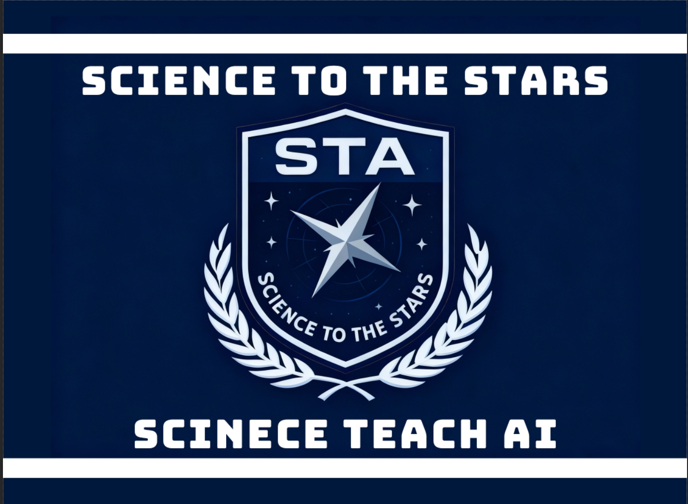

<h1 align="center">STA LAB</h1>

<strong>专注机械工程，深耕油田技术，探索智能系统，创造工程价值。</strong>

在 STA ，我们把 <strong>工程难题</strong> 变成创新课题，把 <strong>技术研究</strong> 变成实用方案， 
把 <strong>只能系统</strong> 变成高效工具，把 <strong>行业需求</strong> 变成技术进步。

---

<h2 align="center">🔬 实验室概况</h2>

**STA LAB**专注于机械、计算机、电子、电气与AI的交叉应用研究与工程创新。

我们立足于实际工程需求，通过系统化的研究方法和严谨的工程实践，将前沿技术转化为可落地的解决方案。实验室秉承"研究为基、工程为用"的理念，致力于在以AI为中心的交叉方向等方面取得突破性进展。

---

<h2 align="center">🧩 核心技术与工具</h2>

**机械与工程工具**：
- SolidWorks / AutoCAD：机械设计与建模
- MATLAB / Simulink：系统仿真与控制算法
- ANSYS / COMSOL：有限元分析与多物理场仿真

**智能与数据分析**：
- Python：数据分析、机器学习、自动化控制
- C++：嵌入式系统、实时控制、高性能计算
- TensorFlow / PyTorch：深度学习与智能算法

**工程管理协作**：
- Git：版本控制与团队协作
- Docker：开发环境与部署标准化
- 飞书平台：项目管理与组织协同

---

<h2 align="center">🚀 主要研究方向</h2>

### 1. 智能机械系统
- 机电一体化设计与优化
- 自动化控制与机器人技术
- 传感器网络与数据采集系统
- 故障诊断与预测性维护

### 2. 油田工程技术
- 油田设备智能化改造
- 钻井与采油过程优化
- 油气输送系统安全监测
- 油田环境保护技术

### 3. 交叉学科应用
- 机械+AI的智能监测系统
- 数据驱动的设备健康管理
- 物联网技术在工程现场的应用
- 边缘计算与实时控制系统

### 4. 工程创新方法
- 快速原型设计与验证
- 系统集成与测试方法
- 工程经济性与可靠性分析
- 技术成果转化与产业化

---

<h2 align="center">🌌 我们的工作理念</h2>

### 以问题为导向
- 从实际工程问题出发，定义研究目标
- 注重技术的实用性和可落地性
- 追求工程效果而非理论完美

### 系统化研究方法
- 需求分析 → 方案设计 → 系统实现 → 测试验证
- 建立标准化的工作流程与质量体系
- 强调文档化与知识沉淀

### 产学研结合
- 连接理论研究与工程实践
- 促进高校研究成果的工程转化
- 培养具备工程实践能力的研究人才

### 开放协作创新
- 跨学科团队协作
- 开放的技术交流与知识共享
- 与产业界建立紧密合作关系

---

<h2 align="center">✨ 实验室特色</h2>

### 工程导向的研究模式
- 面向真实工程场景开展研究
- 强调从原型到产品的完整过程
- 注重技术的经济性与可靠性

### 规范化管理与运行
- 基于飞书平台的数字化管理
- 标准化的项目流程与文档体系
- 透明的进度跟踪与成果评估

### 实用化的技术路线
- 选择成熟稳定的技术栈
- 注重系统的可维护性
- 平衡先进性与实用性

### 持续的能力建设
- 定期的技术分享与培训
- 系统化的新人培养计划
- 鼓励创新思维与工程实践

---

<h2 align="center">📊 实验室成果</h2>

<table align="center">
<tr>
<td align="center">

</td>
<td align="center">

</td>
</tr>
</table>

---

<h2 align="center">📈 项目活动</h2>

---

<h2 align="center">🧪 代表性项目</h2>

### 1. 油田设备智能监测系统
- **目标**：实现对油田关键设备的实时状态监测与故障预警
- **技术**：传感器网络+边缘计算+云平台
- **进展**：已完成原型系统开发，进入现场测试阶段

### 2. 机械系统自动化控制平台
- **目标**：开发通用的机械系统控制与优化平台
- **技术**：PLC控制+上位机软件+智能算法
- **进展**：已完成核心框架设计，正在开发应用模块

### 3. 工程数据分析工具集
- **目标**：建立面向工程数据的分析处理工具链
- **技术**：Python数据处理+可视化+机器学习
- **进展**：已完成基础工具开发，正在完善应用案例

### 4. 跨学科创新项目
- **目标**：探索机械工程与其他学科的交叉应用
- **领域**：机械+AI、机械+材料、机械+生物工程
- **进展**：多个探索性项目正在进行中

---

<h2 align="center">🎓 人才培养</h2>

### 人才培养目标
- 培养具备扎实理论基础和工程实践能力的专业人才
- 建立系统化的学习路径与能力发展体系
- 提供从理论学习到项目实践的全方位支持

### 培养模式
1. **基础能力培养**
   - 机械设计与建模技能
   - 控制系统与编程能力
   - 数据分析与算法应用

2. **项目实践锻炼**
   - 参与实际工程项目
   - 从需求分析到系统实现的完整流程
   - 团队协作与项目管理经验

3. **创新能力培养**
   - 鼓励探索性研究与技术创新
   - 支持参与学术交流与竞赛
   - 提供成果转化与产业化的指导

---

<h2 align="center">📡 联系我们</h2>

### 合作方式
- **技术合作**：联合研发、技术咨询、方案设计
- **项目合作**：工程实施、系统集成、产品开发
- **人才培养**：实习实训、联合培养、专业培训
- **学术交流**：技术研讨、学术会议、成果展示

### 联系方式
- **实验室负责人**：谢承旭
- **所属单位**：优静工作室 - 机械部
- **研究方向**：机械工程、油田技术、智能系统
- **合作理念**：开放、务实、创新、共赢

---

<h2 align="center">🌟 加入我们</h2>

无论您是：
- 对机械工程与智能技术感兴趣的学生
- 希望在油田工程技术领域深入研究的工程师
- 寻求技术合作与创新的企业伙伴
- 关注工程实践与产业应用的研究人员

STA 工程实验室都诚挚欢迎您的加入！

我们提供：
1. **实践平台**：参与真实工程项目的机会
2. **成长空间**：系统化的能力培养与发展路径
3. **合作网络**：连接产业界与学术界的桥梁
4. **创新环境**：鼓励探索与突破的研究氛围

**让我们共同推动工程技术进步，创造实用价值！**

---

<small>© 2026 STA Engineering Laboratory. 保留所有权利。</small>

